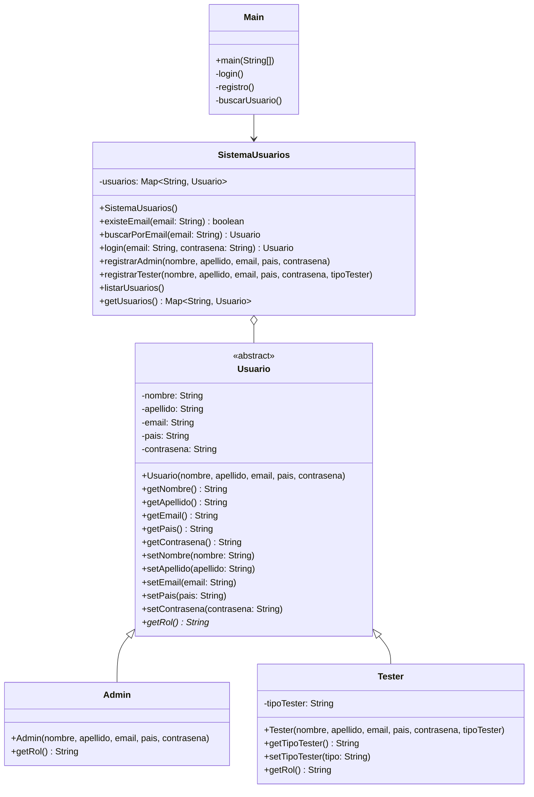

# Proyecto Admin CES
Este proyecto corresponde al relevamiento inicial del sistema Admin CES y a la implementación de primeras funcionalidades por consola en Java.

## Funcionalidades detectadas en el sistema
* Inicio de sesión: permite acceder al sistema con un usuario registrado.  
  Datos requeridos: email y contraseña.
* Registro de usuario administrador: permite registrar un nuevo usuario administrador en el sistema.  
  Datos requeridos: nombre, apellido, email, contraseña y país de nacimiento.
* Visualización de usuarios: permite ver el listado de usuarios registrados en el sistema.  
  Datos requeridos: no requiere ingresar datos adicionales.
* Reinicio de contraseña: permite restablecer la contraseña de un usuario.  
  Datos requeridos: email y nueva contraseña.
* Alta de cuenta para tester: permite registrar un usuario tester en el sistema.  
  Datos requeridos: nombre, apellido, email, país, contraseña y tipo de tester.
* Ver perfil de usuario administrador: permite consultar los datos del usuario administrador autenticado.  
  Datos requeridos: usuario autenticado.
* Editar perfil de usuario administrador: permite modificar los datos del usuario administrador autenticado.  
  Datos requeridos: nombre, apellido, email, país y contraseña.
* Eliminar usuario: permite eliminar un usuario tester del sistema.  
  Datos requeridos: usuario a eliminar.
* Cerrar sesión: permite finalizar la sesión del usuario autenticado.  
  Datos requeridos: no requiere ingresar datos adicionales.

## Funcionalidades implementadas por consola
* Menú principal con opciones de Login, Registro, Listar usuarios, Buscar usuario y Salir.
* Registro de usuario administrador o tester, con selección de tipo por menú numérico.
* Validación de datos básicos durante el registro.
* Login con verificación de email y contraseña.
* Mensajes de error cuando el usuario no existe o la contraseña es incorrecta.
* Listado de todos los usuarios registrados en el sistema.
* Búsqueda de usuario por email con visualización de sus datos.

## Modelo de clases
`Usuario` es una clase abstracta con atributos privados compartidos por todas las subclases. Cada tipo de usuario (`Admin`, `Tester`) hereda de `Usuario` e implementa el método abstracto `getRol()` de forma propia.

## Cambios respecto a la actividad anterior
* `Usuario` pasó a ser clase abstracta. El método `getRol()` se declaró abstracto, obligando a cada subclase a implementarlo.
* `Tester` y `Admin` incorporaron la anotación `@Override` sobre `getRol()`.
* `SistemaUsuarios` reemplazó el `ArrayList<Usuario>` por un `Map<String, Usuario>` con `HashMap`, usando el email como clave. Los métodos de búsqueda pasaron de recorrer la lista manualmente a usar `.containsKey()` y `.get()`.
* Se incorporaron las funcionalidades de listar y buscar usuario, accesibles desde el menú principal.
* El método `registro()` fue corregido para diferenciar entre Admin y Tester al momento del registro.

## Diagrama de clases UML

